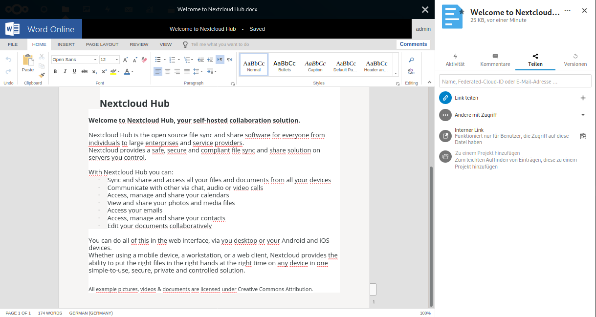

# Office Online integration



## Branches

We currently maintain two branches for compatibility with Nextcloud versions:

- main (Nextcloud 24 upwards)
- stable1 (Nextcloud 22-23)

## Development setup

Just clone this repo into your apps directory ([Nextcloud server](https://github.com/nextcloud/server#running-master-checkouts) installation needed). Additionally, [npm](https://www.npmjs.com/) and [Node.js](https://nodejs.org/en/download/package-manager/) are needed for installing JavaScript dependencies and building the frontend code.

Once npm and Node.js are installed, this can be done by running:
```bash
npm ci
npm run dev
```

## Installation

### Server

You will need an working on-premise Office Online server which has added the Nextcloud server as a trusted host for WOPI. The cloud-based Office 365 is not supported.

- [Deploy Office Online Server](https://docs.microsoft.com/en-us/officeonlineserver/deploy-office-online-server)

## Support

- [Our Forum](https://help.nextcloud.com/c/apps/officeonline/173)

Enterprise users who need a more reliable and scalable solution can take advantage of Nextcloud GmbH's optional support contract for Office Online integration. Find out more about Enterprise support over here: https://nextcloud.com/enterprise/

- [Request a quote](https://nextcloud.com/enterprise/buy/)


## Known problems

- Users are not removed or document is not unlocked with Chrome (or chromium-based browsers)
  - This is a known problem according to different sources for the Office Online Server and is out of scope of the Nextcloud intergration. You can work around this by configuring a lock timeout for the files_lock app or manually unlocking file file
  - https://stackoverflow.com/questions/62062629/office-online-server-didnt-send-unlock-action-when-i-closed-the-session
  - https://social.msdn.microsoft.com/Forums/office/en-US/1b783d1c-c686-4b2d-b23f-4977e6bed806/wopi-unlock-call-never-gets-triggered-in-chrome-and-latest-edge-browser?forum=os_office
